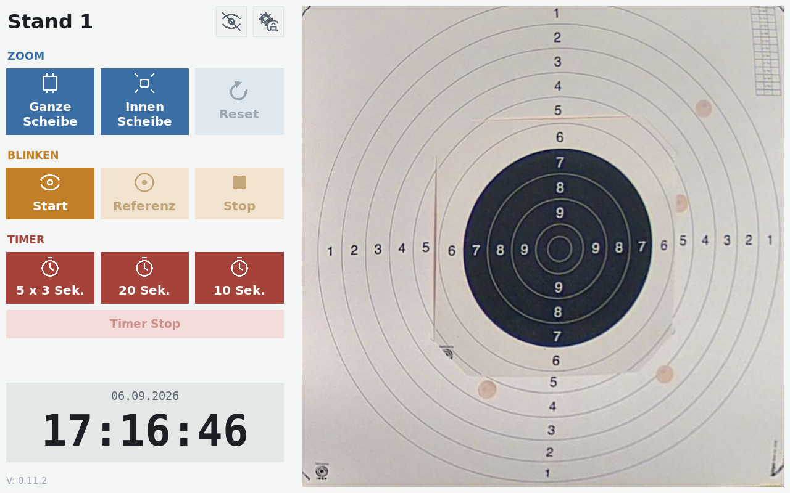

# TargetDisplay

Fullscreen kiosk display for a shooting-range target camera. Straightens out the camera's oblique viewing angle into a top-down view of the target, and gives range officers a set of on-screen tools during training and competition.



## Features

- **Perspective correction** — a four-point transform turns an angled camera view into a straight top-down view, so the camera doesn't need to be mounted directly above the target
- **Two zoom levels** — full target overview and a detail view, with click-and-hold panning while zoomed
- **"Blink" compare mode** — alternates between a held reference frame and the live feed to make new shot holes easier to spot
- **Built-in competition timers** — e.g. a 5×(3s/7s) sequence, a 20s sequence, and a 10s sequence, with on-screen countdown
- **PIN-gated in-app settings** — re-calibrate the four-point regions directly on the device (drag the corners on a live still image, with a magnifier for precise placement), switch which stand/camera the device shows, change the PIN, and trigger a device restart, all behind a numeric PIN so passers-by can't reach them
- **Multi-stand aware** — a single install can serve any number of stands/camera locations; which one a given device shows is picked once, on the device itself, from a shared list rather than baked in per install (see [Configuration reference](#configuration-reference))
- A live FPS readout
- Runs unattended as a borderless fullscreen kiosk
- Touch-friendly button layout — designed to be operated directly on a touchscreen, no mouse/keyboard needed

## Requirements

- Raspberry Pi (or similar Linux SBC) with an attached display (touchscreen recommended)
- Python 3 with `opencv-python`, `numpy`, `PySimpleGUI` (**pinned to 4.60.5.1 or older** — later releases require a paid license), `config_with_yaml`
- An RTSP/RTMP camera feed

In production this runs on a Raspberry Pi 4, Raspberry Pi OS Lite (64-bit), with a Joy-IT RB-LCD10-2 10.1" HDMI touchscreen.

## Setup

```bash
pip3 install -r requirements.txt opencv-python numpy
cp config.yml.dist config.yml
# edit config.yml: camera URL, screen size, and the four-point regions for your camera angle
python3 main.py
```

`requirements.txt` pins the versions verified against production. On Debian/Raspberry Pi OS, prefer installing `opencv-python`/`numpy` via `apt` (`python3-opencv`, `python3-numpy`) instead of pip — see the comments in `requirements.txt` for why.

`ressources/logo.png` (RGBA) is shown small in the sidebar and centered as a watermark when the video feed is toggled off — ships with a generic placeholder shield, swap in your own club/range logo there. The app runs fine without one too (missing file, not an error — the logo areas just stay empty).

On the production Pis, `pip`-managed dependencies live in a `.venv` (created with `--system-site-packages` so it still sees the apt-installed `opencv`/`numpy`/`tkinter`), and `play_it` runs `main.py` through `.venv/bin/python3`:

```bash
python3 -m venv --system-site-packages .venv
.venv/bin/pip install -r requirements.txt
.venv/bin/python3 main.py
```

For unattended kiosk operation on a Raspberry Pi, `play_it` is the launcher script that runs `main.py`; see [`ansible/`](ansible/) for the automated setup that installs it as a systemd service (X11 session via `startx`, auto-restart on failure, no desktop interaction needed).

## Configuration reference

| Setting | Description |
|---|---|
| `screenSize` | Window size in pixels, e.g. `[1024, 768]` |
| `settingsPin` | 4-6 digit numeric PIN gating the in-app Settings/Restart buttons. Optional — omitted, it falls back to the built-in default `"1234"`, and the app forces a PIN change on first run rather than staying on that default |
| `standName` | Label shown in the top-left corner. Optional, see below |
| `video.url` | RTSP/RTMP URL of the camera. Optional, see below |
| `video.section_full` | Four corner points `[[x,y], ...]` for the full-overview perspective transform. Optional, see below |
| `video.section_detail` | Four corner points for the detail/zoomed-in perspective transform. Optional, see below |
| `video.size` | Internal processing resolution (`x`, `y`) before display scaling |

There are two ways to get a stand's name/camera/regions into the app — pick one:

- **Simple, single-stand:** fill in `standName`/`video.url`/`video.section_full`/`video.section_detail` directly in `config.yml`, as shown in `config.yml.dist`. The app never shows the setup wizard below.
- **Multi-stand:** leave those four out of `config.yml` entirely. On first run (no stand selected yet, or no calibration yet, or the PIN still at its default), the app instead walks through an on-device setup wizard — pick a stand from a shared list, drag the four corners into place for each region, then set a real PIN — before it'll show the normal kiosk screen. The shared stand list (name + camera URL per stand) is deployed identically to every device by Ansible (see [`ansible/`](ansible/)); which stand a *specific* device shows, its calibrated regions, and its PIN are each chosen once on that device and stored as override files on the boot partition (survives reboots, including with a read-only root filesystem, without needing to touch `config.yml`). All three can be changed again later from the in-app Settings screen. Any override file present takes precedence over the corresponding value in `config.yml`.

## License

[MIT](LICENSE)
