# TargetDisplay – Benutzerhandbuch

*Version des Handbuchs: September 2026, bezogen auf TargetDisplay v0.11.x*

## 1. Einleitung

TargetDisplay ist die Bildschirmanzeige an den Schießständen unseres Vereins. Eine Kamera blickt schräg auf die Zielscheibe, und die App rechnet dieses Bild automatisch so um, dass die Scheibe gerade von oben zu sehen ist – so, als würde man direkt davorstehen. Das Gerät läuft auf einem kleinen Touchscreen-Computer direkt am Stand und wird ausschließlich mit dem Finger bedient, eine Maus oder Tastatur wird nicht benötigt.

Neben der reinen Live-Ansicht der Scheibe bietet TargetDisplay ein paar Werkzeuge, die den Trainings- und Wettkampfbetrieb erleichtern: zwei Zoomstufen (ganze Scheibe oder ein vergrößerter Innenbereich), einen „Blinken“-Vergleichsmodus, der zwischen einem gemerkten Referenzbild und dem aktuellen Live-Bild hin- und herschaltet (praktisch, um neue Einschusslöcher zu erkennen), sowie mehrere eingebaute Wettkampf-Timer mit Countdown-Anzeige. Ein kleiner, durch eine PIN geschützter Einstellungsbereich erlaubt es Standaufsichten außerdem, das Gerät bei Bedarf direkt am Stand neu zu kalibrieren oder umzukonfigurieren.

Dieses Handbuch beschreibt zunächst die Bedienelemente für den täglichen Gebrauch (Kapitel 2), die für alle Vereinsmitglieder gedacht sind. Kapitel 3 behandelt den PIN-geschützten Administrativen Bereich, der sich an Standaufsichten richtet.

---

## 2. Der Hauptbildschirm

Der Hauptbildschirm ist die Ansicht, die nach dem Einschalten des Geräts dauerhaft zu sehen ist. Links liegen die Bedienelemente, rechts das entzerrte Kamerabild der Scheibe.

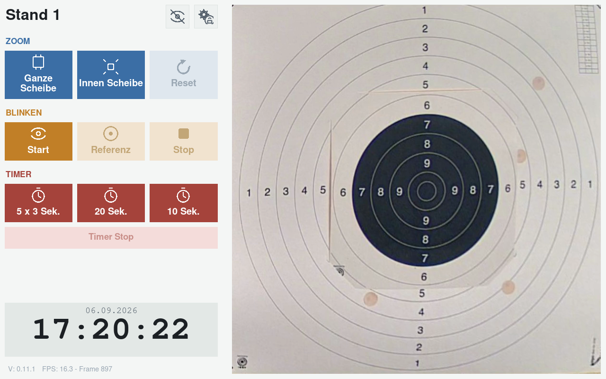

**Abb. 1:** Hauptbildschirm im Normalzustand.

Die Nummerierung startet in jeder Gruppe neu bei 1 – gemeint ist immer die Position innerhalb der jeweiligen Gruppe (Kopfzeile, Zoom, Blinken, Timer, Fußbereich), nicht eine durchlaufende Zählung über den ganzen Bildschirm.

**Kopfzeile (oben)**

1. **Standname** (oben links, z. B. „Stand 1“) – zeigt an, welcher Schießstand gerade angezeigt wird. Rein informativ, kein Bedienelement.
2. **Video-aus-Symbol** (Auge mit Schrägstrich, oben rechts, linkes der beiden kleinen Symbole) – blendet das Kamerabild aus und zeigt stattdessen das Vereinswappen auf schwarzem Grund (siehe Abschnitt „Video aus“ unten). Ein erneuter Klick schaltet das Bild wieder ein. Solange das Bild ausgeblendet ist, sind Zoom, Blinken und Timer nicht bedienbar.
3. **Einstellungen-Symbol** (Zahnrad mit Schloss, oben rechts, rechtes der beiden kleinen Symbole) – öffnet den PIN-geschützten Administrativen Bereich, siehe Kapitel 3.

**Gruppe „Zoom“ (blau)**

1. **Ganze Scheibe** – zeigt die komplette Zielscheibe in der Übersicht. Das ist die Standardansicht.
2. **Innen Scheibe** – vergrößert auf den inneren, hochwertigeren Bereich der Scheibe (eigener, separat kalibrierter Bildausschnitt).
3. **Reset** – setzt Zoomstufe und eine eventuelle manuelle Verschiebung des Bildausschnitts (siehe Punkt 4) wieder auf „Ganze Scheibe“ ohne Verschiebung zurück. Der Button ist nur dann farbig/aktiv, wenn es überhaupt etwas zurückzusetzen gibt – im Ausgangszustand ist er ausgegraut.
4. **Tippen auf das Kamerabild** – der erste Tipp legt den Mittelpunkt für einen manuellen Bildausschnitt fest; tippt man danach nahe an einen Bildrand (oben/unten/links/rechts), wandert der sichtbare Ausschnitt schrittweise in diese Richtung. So lässt sich bei Bedarf gezielt in eine Ecke der Scheibe hineinschauen. Über „Reset“ (Punkt 3) kommt man wieder zur normalen, zentrierten Ansicht zurück.

**Gruppe „Blinken“ (orange)** – Vergleichsmodus zum Erkennen neuer Einschusslöcher, Details siehe Abschnitt 2.2 unten.

1. **Start** – merkt sich das aktuelle Kamerabild als Referenz und beginnt das Blinken zwischen Referenz und Live-Bild.
2. **Referenz** – nimmt eine neue Referenzaufnahme auf, ohne den Blinken-Modus zu verlassen.
3. **Stop** – beendet das Blinken, es wird wieder ausschließlich das Live-Bild gezeigt.

**Gruppe „Timer“ (rot)** – eingebaute Wettkampf-Countdowns, Details siehe Abschnitt 2.3 unten.

1. **5 x 3 Sek.** – fünf Durchgänge im Wechsel, Scheibe 3 Sekunden sichtbar, 7 Sekunden verdeckt.
2. **20 Sek.** – eine einzelne Zeitscheibe von 20 Sekunden.
3. **10 Sek.** – eine einzelne Zeitscheibe von 10 Sekunden.
4. **Timer Stop** – bricht einen laufenden Timer vorzeitig ab. Nur während eines laufenden Timers farbig/aktiv.

**Fußbereich (unten)**

1. **Datum/Uhrzeit-Anzeige** – zeigt die aktuelle Uhrzeit groß und das Datum darüber. Rein informativ.
2. **Versions-/FPS-Anzeige** (ganz unten links, kleine graue Schrift) – zeigt die installierte Programmversion sowie, während das Live-Bild läuft, die aktuelle Bildwiederholrate (FPS) und die Anzahl empfangener Bilder. Dient vor allem der Fehlersuche durch Technik/Standaufsicht, für den normalen Betrieb ohne Bedeutung.

### 2.1 Zoom im Detail

- **Ganze Scheibe** und **Innen Scheibe** schließen sich in der Wirkung gegenseitig aus – es ist immer genau eine der beiden Stufen tatsächlich aktiv. Das sieht man den beiden Buttons farblich aber nicht an: Beide bleiben durchgehend kräftig blau, da sich jederzeit erneut zwischen ihnen wechseln lässt.
- Ist eine der beiden Zoomstufen aktiv und man tippt zusätzlich auf das Bild, verschiebt sich der sichtbare Ausschnitt innerhalb dieser Zoomstufe – das eigentliche Zoom-Verhältnis ändert sich dabei nicht.
- **Reset** bringt in einem Schritt beides zurück: „Ganze Scheibe“ und keine manuelle Verschiebung.

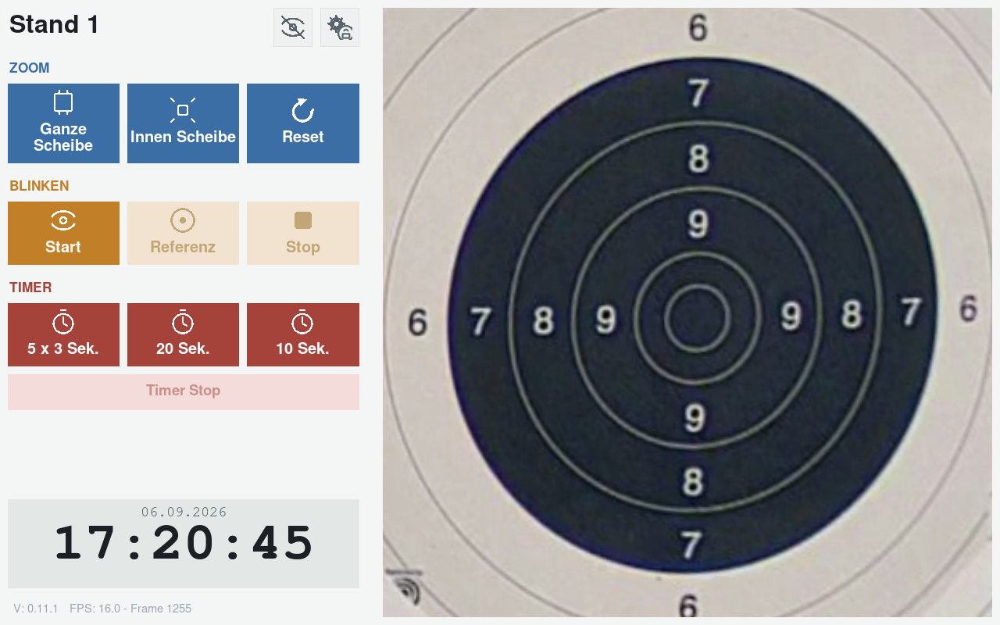

**Abb. 2:** „Innen Scheibe“ ist aktiv (auch „Ganze Scheibe“ bleibt blau, siehe oben) – erkennbar ist der Wechsel hier an „Reset“, das dadurch jetzt nutzbar ist (blau statt blass).

### 2.2 „Blinken“-Vergleichsmodus im Detail

Das Bild wechselt sekündlich zwischen dem festgehaltenen Referenzbild und dem aktuellen Live-Bild hin und her. Löcher, die zwischen Referenz und Live-Bild „aufblinken“, sind neu – typischer Anwendungsfall: **Referenz** direkt nach einer geschossenen Serie erneut auslösen, um die nächste Serie einzeln sichtbar zu machen. Während des Blinkens sind die Timer-Buttons gesperrt und dabei sichtbar ausgegraut. Der Video-aus-Knopf ist ebenfalls gesperrt, ändert dabei aber äußerlich nicht sein Aussehen – er sieht weiterhin normal aus, reagiert aber nicht auf Tippen. Zoom bleibt weiterhin bedienbar. **Stop** gibt Timer und Video-aus-Knopf wieder frei.

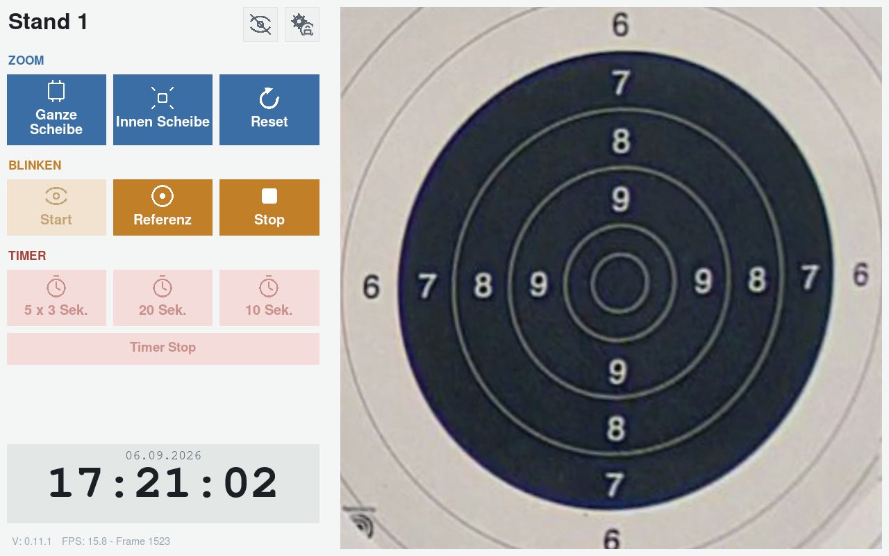

**Abb. 3:** „Blinken“ ist aktiv (Start ausgegraut, Referenz/Stop aktiv), Zoom bleibt bedienbar, Timer ist gesperrt.

### 2.3 Wettkampf-Timer im Detail

**20 Sek.** und **10 Sek.** laufen nach demselben einfachen Muster ab: Der Bildschirm wird komplett **rot** mit einer großen, rückwärtszählenden Zahl als 7-Sekunden-Vorbereitungszeit; danach wird der Bildschirm **grün** für die eingestellte Sichtzeit (mit Countdown); anschließend kurz (3 Sekunden) wieder **rot** als Stopp-Phase, danach schaltet der Timer automatisch ab.

**5 x 3 Sek.** beginnt ebenfalls mit der 7-Sekunden-Vorbereitungszeit in Rot, wiederholt danach aber fünfmal denselben Wechsel: 3 Sekunden **grün** (Scheibe sichtbar, mit Countdown und Durchgangszähler), gefolgt von 7 Sekunden **rot** (Scheibe verdeckt, ebenfalls mit Countdown und Durchgangszähler). Nach dem fünften Durchgang folgt, genau wie bei den anderen beiden Varianten, dieselbe kurze (3 Sekunden) rote Stopp-Phase, danach schaltet der Timer automatisch ab.

Während eines laufenden Timers wird kein Kamerabild angezeigt und Zoom/Blinken/Video-aus sind gesperrt.

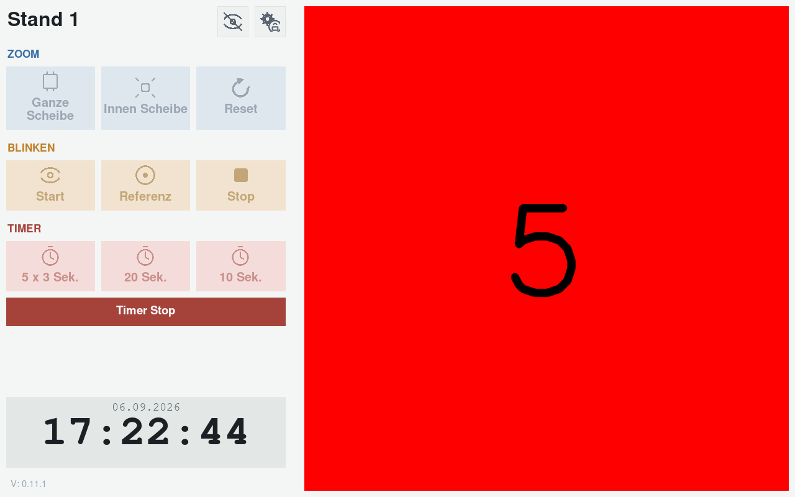

**Abb. 4:** Vorbereitungsphase (rot) mit rückwärtszählendem Countdown.

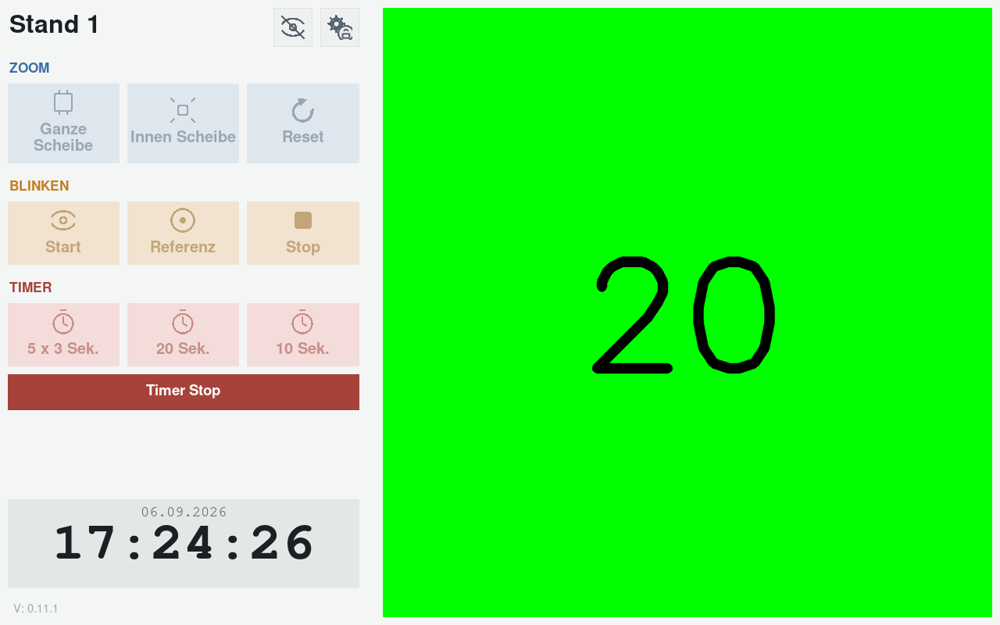

**Abb. 5:** Sichtzeit läuft (grün).

### 2.4 „Video aus“

Ein Klick auf das Augen-Symbol in der Kopfzeile (Punkt 2) blendet das Kamerabild aus und zeigt stattdessen das Vereinswappen auf schwarzem Grund – etwa wenn zwischen zwei Trainingseinheiten niemand am Stand ist. Die Uhrzeit/Datumsanzeige läuft normal weiter. Das Symbol wechselt dabei auf ein Auge ohne Schrägstrich; ein erneuter Klick darauf schaltet das Live-Bild wieder ein.

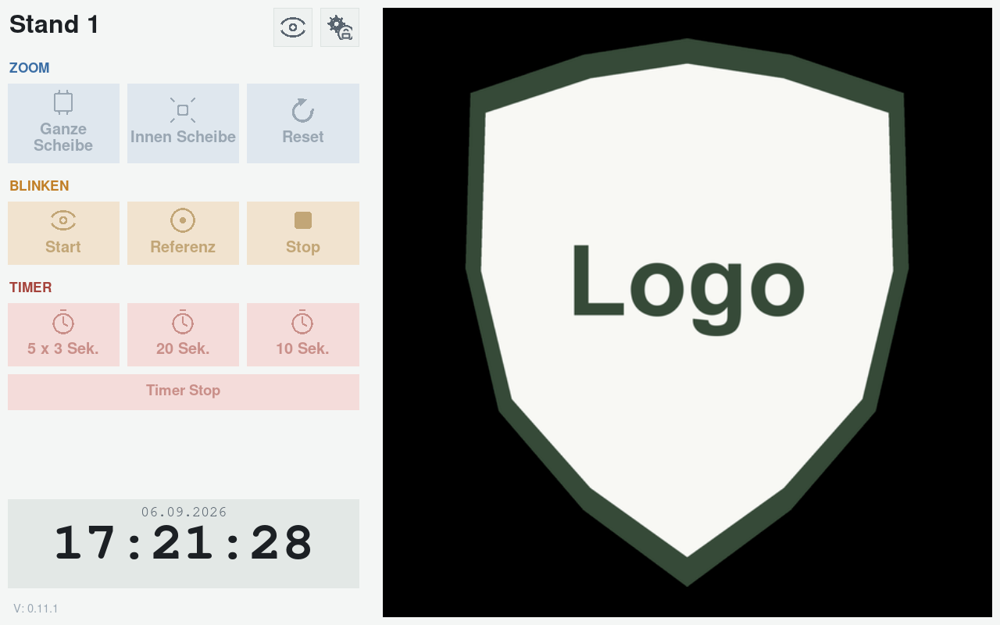

**Abb. 6:** Video ausgeblendet, Vereinswappen als Wasserzeichen auf schwarzem Grund.

---

## 3. Administrativer Bereich (PIN-geschützt)

**Dieser Abschnitt richtet sich an Standaufsichten**, nicht an normale Vereinsmitglieder. Alle hier beschriebenen Funktionen sind über das Zahnrad-Symbol in der Kopfzeile (Punkt 3, oben) erreichbar und durch eine numerische PIN geschützt, damit nicht versehentlich (oder durch Unbefugte) Einstellungen verändert werden.

Der PIN-Schutz ist bewusst kein Hochsicherheitsmechanismus gegen gezielte Angriffe (es gibt z. B. keine Kontosperre nach mehreren Fehlversuchen) – er soll lediglich zufälliges Herumtippen von Passanten am Gerät verhindern.

### 3.1 PIN-Eingabe

Nach Klick auf das Zahnrad-Symbol erscheint das PIN-Tastenfeld:

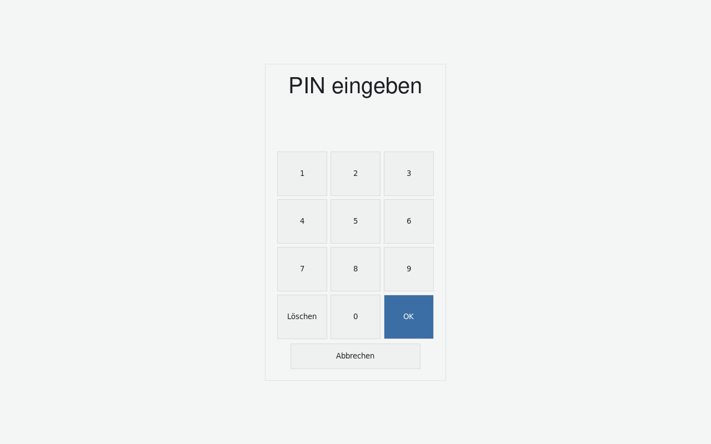

**Abb. 7:** PIN-Tastenfeld.

1. **Ziffernblock 0–9** – Eingabe der PIN (4–6-stellig). Eingegebene Ziffern werden als Sternchen dargestellt.
2. **Löschen** – setzt die aktuelle Eingabe zurück auf leer.
3. **OK** (blau hervorgehoben) – bestätigt die Eingabe. Bei falscher PIN erscheint kurz „falsch“ in Rot, danach kann erneut eingegeben werden.
4. **Abbrechen** – bricht die PIN-Eingabe ab und kehrt zum Hauptbildschirm zurück.

Nach korrekter Eingabe öffnet sich das Einstellungen-Menü.

### 3.2 Einstellungen-Menü

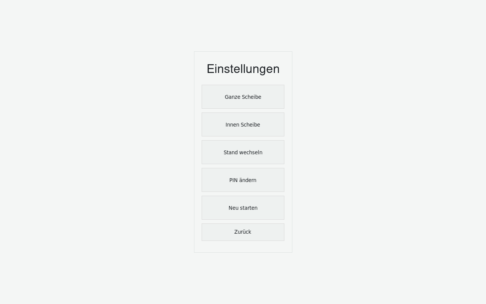

**Abb. 8:** Einstellungen-Menü.

1. **Ganze Scheibe** – öffnet den Ausschnitte-Editor (siehe 3.3) zur Neukalibrierung des Bildausschnitts „Ganze Scheibe“.
2. **Innen Scheibe** – öffnet denselben Editor für den Ausschnitt „Innen Scheibe“ (Detailzoom).
3. **Stand wechseln** – öffnet die Stand-Auswahl (siehe 3.4), um dieses Gerät auf einen anderen Schießstand/eine andere Kamera umzustellen.
4. **PIN ändern** – startet den Dialog zum Ändern der Einstellungs-PIN (siehe 3.5).
5. **Neu starten** – öffnet die Neustart-Bestätigung (siehe 3.6) und startet das Gerät nach Bestätigung neu.
6. **Zurück** – verlässt das Einstellungen-Menü ohne Änderung und kehrt zum Hauptbildschirm zurück.

**Wichtig:** Wird über „Ganze Scheibe“, „Innen Scheibe“, „Stand wechseln“ **oder „PIN ändern“** tatsächlich eine Änderung gespeichert, startet das Gerät danach automatisch neu, damit die neuen Werte sauber übernommen werden (kurzzeitig schwarzer Bildschirm, danach normaler Betrieb mit neuer Einstellung) – das gilt einheitlich für alle vier Aktionen, auch wenn ein Neustart für die PIN-Änderung allein technisch nicht nötig wäre. Ein Abbruch in einem der Unterdialoge führt dagegen nur einen Schritt zurück zu diesem Menü, nicht bis zum Hauptbildschirm.

### 3.3 Ausschnitte-Editor (Kalibrierung)

Hier werden die vier Eckpunkte festgelegt, die den schrägen Kamerablick auf die Zielscheibe in ein gerades, top-down-Bild umrechnen – getrennt für „Ganze Scheibe“ und „Innen Scheibe“. Das ist nötig, wenn sich die Kamera oder die Scheibe verschoben hat, oder bei der Ersteinrichtung eines neuen Standes.

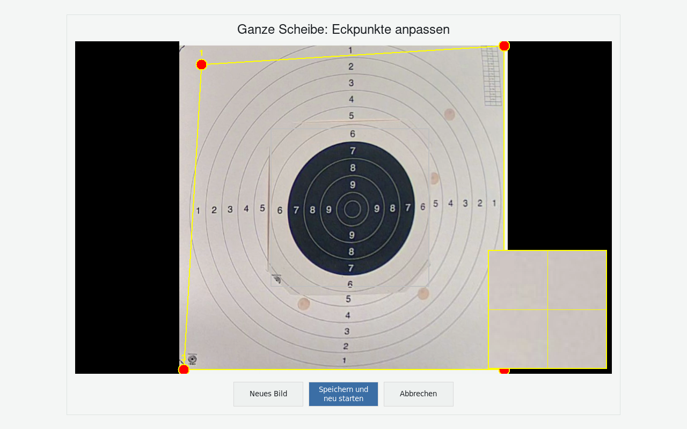

**Abb. 9:** Ausschnitte-Editor, Lupe beim Ziehen eines Eckpunkts eingeblendet.

1. **Titel** (oben) – zeigt an, welcher Ausschnitt gerade bearbeitet wird.
2. **Kamerabild mit vier nummerierten Eckpunkten (1–4, rot/gelb)** – jeder Punkt kann per Fingertipp gegriffen und gezogen werden, um ihn exakt auf eine Ecke der Zielscheibe zu positionieren. Eine gelbe Linie verbindet die vier Punkte zur Kontrolle. Ist der jeweils andere Ausschnitt (z. B. „Innen Scheibe“, während „Ganze Scheibe“ bearbeitet wird) bereits kalibriert, wird er zusätzlich hellgrau zur Orientierung eingeblendet.
3. **Lupe** – solange ein Eckpunkt gezogen wird, blendet sich automatisch eine vergrößerte Detailansicht der Umgebung dieses Punktes in einer Bildecke ein (springt bei Bedarf in die gegenüberliegende Ecke, damit sie den gerade gezogenen Punkt nie verdeckt). Das erleichtert die exakte Platzierung auf den Millimeter genau.
4. **Neues Bild** – holt ein frisches Kamerabild (z. B. falls sich seit dem Öffnen des Editors etwas im Bild geändert hat), ohne bereits gesetzte Punkte zu verwerfen.
5. **Speichern und neu starten** (blau hervorgehoben) – übernimmt die neue Positionierung dauerhaft und startet das Gerät anschließend neu, damit die neue Kalibrierung wirksam wird.
6. **Abbrechen** – verwirft alle Änderungen und kehrt zum Einstellungen-Menü zurück.

### 3.4 Stand wechseln

Erlaubt es, ein und dasselbe Gerät auf einen anderen Schießstand (mit eigener Kamera) umzustellen. Die Liste der verfügbaren Stände wird zentral gepflegt und ist auf allen Geräten der Vereinsflotte identisch – welcher Stand tatsächlich angezeigt wird, wird pro Gerät einzeln hier ausgewählt.

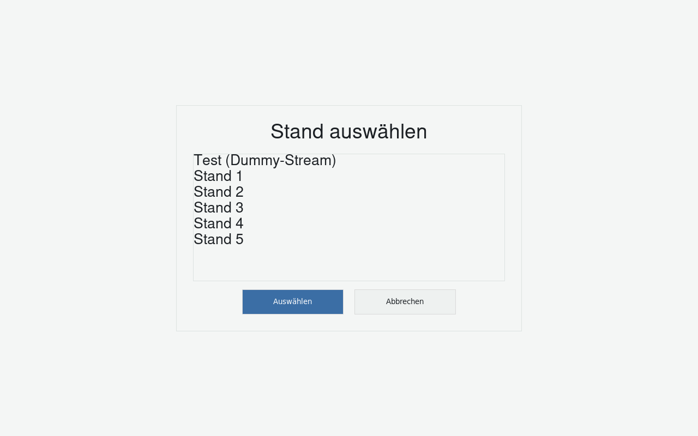

**Abb. 10:** Stand-Auswahl.

1. **Liste der verfügbaren Stände** – ein Fingertipp markiert einen Eintrag.
2. **Auswählen** (blau hervorgehoben) – übernimmt den markierten Stand. Das Gerät verbindet sich anschließend mit dessen Kamera und startet neu.
3. **Abbrechen** – kehrt ohne Änderung zum Einstellungen-Menü zurück.

*Hinweis:* Nach einem Stand-Wechsel muss in aller Regel auch die Kalibrierung (Abschnitt 3.3) für den neuen Stand geprüft/neu gesetzt werden, da sich Kamerawinkel und -position je Stand unterscheiden.

### 3.5 PIN ändern

Anders als die übrigen Unterabschnitte hier ist dies kein einzelner Bildschirm mit festen Bedienelementen, sondern ein Ablauf über mehrere Schritte/Bildschirme hinweg:

1. Zunächst muss die **aktuell gültige PIN** eingegeben werden (dasselbe Tastenfeld wie in 3.1) – so lässt sich verhindern, dass jemand, der zufällig kurz an das offene Einstellungen-Menü gelangt, die PIN einfach überschreibt.
2. Danach erscheint das Tastenfeld erneut mit dem Titel **„Neuen PIN eingeben (4-6 Ziffern)“**:

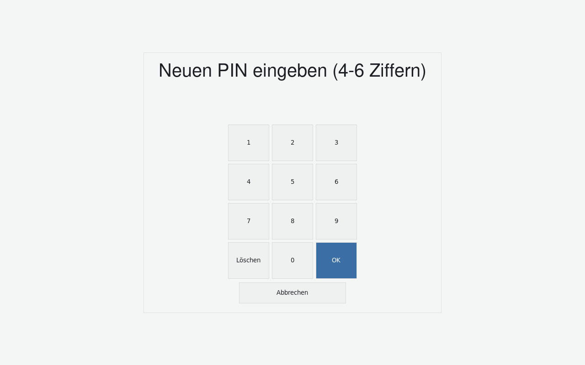

**Abb. 11:** Neuen PIN eingeben.

3. Anschließend muss die neue PIN zur Kontrolle ein zweites Mal eingegeben werden („PIN wiederholen“). Stimmen beide Eingaben nicht überein, erscheint kurz der Hinweis „PINs stimmen nicht überein“, und es geht zurück zu Schritt 2 (neue PIN eingeben) – die bereits bestätigte aktuelle PIN aus Schritt 1 muss dafür nicht erneut eingegeben werden.
4. Nach zweimal übereinstimmender Eingabe wird die neue PIN gespeichert. Genau wie bei den anderen Einstellungsänderungen (siehe 3.2) startet das Gerät danach automatisch neu, damit der neue PIN sauber übernommen wird.
5. **Abbrechen** ist in jedem Schritt möglich und verwirft die Änderung.

### 3.6 Gerät neu starten

Über „Neu starten“ im Einstellungen-Menü lässt sich das Gerät gezielt neu booten, z. B. wenn die Kamera-Verbindung dauerhaft hängt.

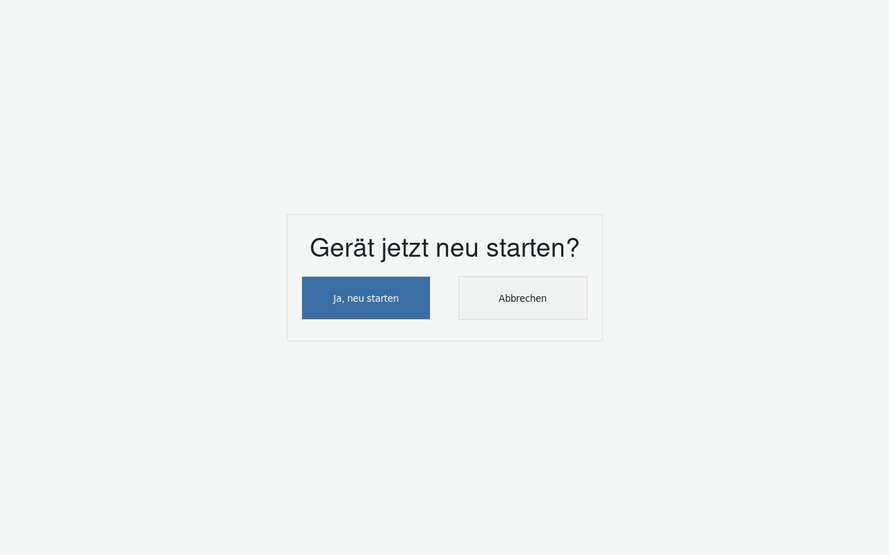

**Abb. 12:** Neustart-Bestätigung.

1. **Ja, neu starten** (blau hervorgehoben) – startet das Gerät sofort neu.
2. **Abbrechen** – kehrt ohne Neustart zum Einstellungen-Menü zurück.

---

## Anhang: Kurzübersicht Ersteinrichtungs-Assistent

Ein fabrikneues bzw. zurückgesetztes Gerät zeigt beim allerersten Start automatisch einen geführten Ersteinrichtungs-Assistenten, bevor der normale Hauptbildschirm überhaupt erreichbar ist. Er läuft in exakt dieser Reihenfolge ab und lässt sich in diesem Zustand nicht abbrechen (kein „Zurück“ zu einem Hauptbildschirm, den es ja noch nicht gibt):

1. **Stand auswählen** – identisch zum Dialog in Abschnitt 3.4, nur ohne „Abbrechen“-Button.
2. **Ausschnitte kalibrieren** – zunächst „Ganze Scheibe“, danach „Innen Scheibe“, jeweils identisch zum Editor in Abschnitt 3.3 (nur ohne „Abbrechen“, und der Speichern-Button heißt hier schlicht „Speichern“, da der Assistent nach jedem Einzelschritt ohne Neustart weiterläuft).
3. **PIN festlegen** – identisch zum Dialog in Abschnitt 3.5, nur ohne vorherige Abfrage einer „alten“ PIN (die eingebaute Werks-PIN muss zwingend geändert werden, bevor das Gerät in Betrieb geht).

Erst wenn alle drei Schritte abgeschlossen sind, erscheint der normale Hauptbildschirm aus Kapitel 2.

---

## Bei Problemen

Lässt sich ein Problem nicht durch einen einfachen Geräteneustart beheben (siehe Abschnitt 3.6), wenden Sie sich bitte an:

   

_______________________________________________________________

   

_______________________________________________________________

---

## Notizen

 

_______________________________________________________________

 

_______________________________________________________________

 

_______________________________________________________________

 

_______________________________________________________________

 

_______________________________________________________________

 

_______________________________________________________________

 

_______________________________________________________________

 

_______________________________________________________________

 

_______________________________________________________________

 

_______________________________________________________________

 

_______________________________________________________________

 

_______________________________________________________________

 

_______________________________________________________________

 

_______________________________________________________________

 

_______________________________________________________________
